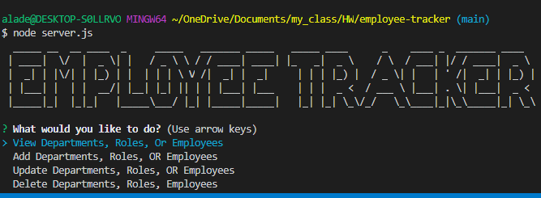

# employee-tracker

## Title:
Employee tracker app

## Description
This Node CLI app allows the user to view and manage the departments, roles, and employees in their company. Such as, adding, apdating or deleting the following: employee, role, and department. This app was built by using node, inquirer, and MySQL.

The following GIF demonstrates the application functionality:

## Installation
The user need to install Node.js and git bash, also the user should install the required node dependencies by using the following command:
npm install

## Table of Contents
  * [Installation](#installation)
  * [Usage](#usage)
  * [Contributing](#contributing)
  * [Questions](#questions)
  * [License](#license)

## Usage
  * The user need to open the terminal (and to make sure to be in the correct directory)
  * By using the comand line, the user should use the command 'node server.js'.
  * Answer the prompted questions to view, update or delete employee, role, and department.

## Contributing
If you would like to contribute, please check out the listed-below CONTRIBUTING file:
[CONTRIBUTING.md](./CONTRIBUTING.md)

## License
MIT license

## Questions
The following is my Github account:
[decoste](https://github.com/decoste)

Please feel free to send me an email if you have any question(s) aladecoste@gmail.com

Screenshot of the CLI:

## Bonus

* TBD

